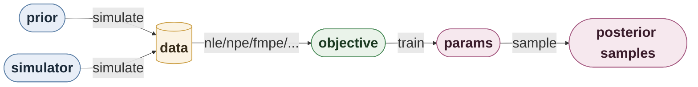

# sbijax 

[](https://github.com/dirmeier/sbijax/actions/workflows/ci.yaml)
[](https://codecov.io/gh/dirmeier/sbijax)
[](https://sbijax.readthedocs.io/en/latest/?badge=latest)
[](https://pypi.org/project/sbijax/)

> Simulation-based inference in JAX

``Sbijax`` is a Python library for neural simulation-based inference and
approximate Bayesian computation using [JAX](https://github.com/google/jax).
It implements recent methods, such as *Simulated Annealing ABC*,
*Surjective Neural Likelihood Estimation*, *Neural Approximate Sufficient Statistics*
or *Neural Posterior Score Estimation*.

> [!CAUTION]
> ⚠️ As per the LICENSE file, there is no warranty whatsoever for this free software tool. If you discover bugs, please report them.

## Quickstart

`Sbijax` implements a fully functional API in the idiom of [Haiku](https://github.com/google-deepmind/dm-haiku):
every method is a factory returning a tuple of pure functions. All a user needs to define is a prior function, a simulator function
and an inferential algorithm. For example, you can define a neural likelihood estimation method and generate posterior samples like this:

```python
from jax import numpy as jnp, random as jr
from tensorflow_probability.substrates.jax import distributions as tfd

from sbijax import nle, train, sample, simulate
from sbijax.mcmc import make_sampler, nuts
from sbijax.nn import make_maf

prior = tfd.JointDistributionNamed(dict(
    theta=tfd.Normal(jnp.zeros(2), jnp.ones(2))
), batch_ndims=0)

def simulator_fn(seed, theta):
    p = tfd.Normal(jnp.zeros_like(theta["theta"]), 0.1)
    y = theta["theta"] + p.sample(seed=seed)
    return y

estimator = nle(make_maf(2))

y_observed = jnp.array([-1.0, 1.0])
data = simulate(jr.key(1), prior, simulator_fn, n=10_000)
params, info = train(jr.key(2), estimator, data)
samples, _ = sample(
    jr.key(3), estimator, params, y_observed,
    sampler=make_sampler(nuts, prior=prior),
)
```

More self-contained examples can be found in [examples](https://github.com/dirmeier/sbijax/tree/main/examples).

## Workflow

Every method in `sbijax` takes the same two user-supplied inputs:

* a **prior**: needs a `.sample(seed=rng_key)` method returning a pytree, a
  batched form `.sample(seed=rng_key, sample_shape=(n,))`, and a
  `.log_prob(theta)` method accepting that same pytree structure. A pytree
  here just means a (possibly nested) dict of arrays, e.g. what the `prior`
  in the example above returns from `.sample(...)`:

  ```python
  {"theta": Array([0.62, 0.84])}
  ```

  Nothing checks that the prior is literally a
  `tensorflow_probability.substrates.jax` (`tfd`) distribution, but every
  example uses a `tfd.JointDistributionNamed`, which gives you both methods
  for free
* a **simulator**: a plain function `(seed, theta) -> y`. Use those exact
  argument names (or `**kwargs`) — ABC methods (`sabc`/`smcabc`) call it by
  keyword internally. `simulate`/`run_sequential` always call it with a
  **batched** `theta` (a leading axis of size `n`), so it needs to handle a
  batch of parameter draws, not a single one

From these two, the same pipeline applies to every neural estimator (NLE, NPE,
FMPE, NPSE, NRE, SNLE):



1. `simulate(rng_key, prior, simulator, n)` draws `n` prior/simulation pairs.
2. A factory (`nle`, `npe`, `fmpe`, ...) wraps a neural network into an
   `ObjectiveFns` record of pure functions.
3. `train(rng_key, objective, data)` fits it, returning `params`.
4. `sample(rng_key, objective, params, observable)` draws posterior samples
   (MCMC-based methods also take `sampler=make_sampler(nuts, prior=prior)`).

## Installation

Make sure to have a working `JAX` installation. Depending whether you want to use CPU/GPU/TPU,
please follow [these instructions](https://github.com/google/jax#installation).

To install from PyPI, just call the following on the command line:

```bash
pip install sbijax
```

To install the latest GitHub <RELEASE>, use:

```bash
pip install git+https://github.com/dirmeier/sbijax@<RELEASE>
```

## Documentation

Documentation can be found [here](https://sbijax.readthedocs.io/en/latest/).

## Contributing and Support

If you have questions, encounter problems, or need support with this software, please use the following channels:

* **Questions & Discussions:** For general questions, usage help, or architectural discussions, please open a new thread in our [GitHub Discussions](https://github.com/dirmeier/sbijax/discussions) tab.
* **Bug Reports & Feature Requests:** To report a bug, software problem, or suggest a new feature, please submit an issue via our [GitHub Issue Tracker](https://github.com/dirmeier/sbijax/issues). Please check existing issues before opening a new one to ensure it hasn't already been reported.

Code contributions in the form of pull requests are more than welcome. A good way to
start is to check out issues labelled
[good first issue](https://github.com/dirmeier/sbijax/issues?q=is%3Aissue+is%3Aopen+label%3A%22good+first+issue%22). If you are unsure, if starting to work on a PR makes
sense, feel free to open an issue or discussion thread.

In order to contribute:

1) Clone `sbijax` and install `uv` from [here](https://docs.astral.sh/uv/getting-started/installation/).
2) Install all dependencies using `uv sync --all-groups`.
3) Install the Git hooks:
   ```bash
   uv run pre-commit install -t pre-commit -t commit-msg
   ```
4) Create a new branch locally, e.g. `git checkout -b feature/my-new-feature`.
5) Implement your contribution and ideally a test case.
6) Check your work (see below).
7) Submit a PR 🙂.

### Development commands

The project uses `uv` for everything:

```bash
uv sync --all-groups
uv run pre-commit run --all-files
uv run pytest
uv run ruff check sbijax examples
uv run ruff check --fix sbijax examples
uv run ruff format sbijax examples
uv run mypy sbijax examples
```

## Acknowledgements

> [!NOTE]
> 📝 The API of the package is heavily inspired by [`Haiku`](https://github.com/google-deepmind/dm-haiku).
