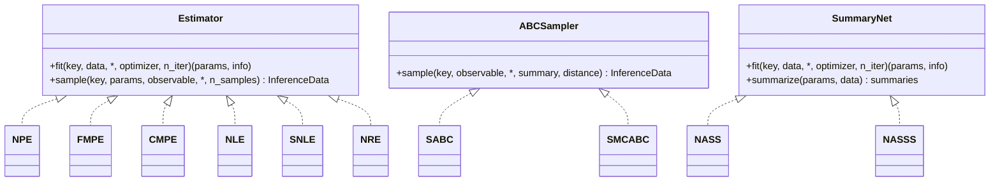
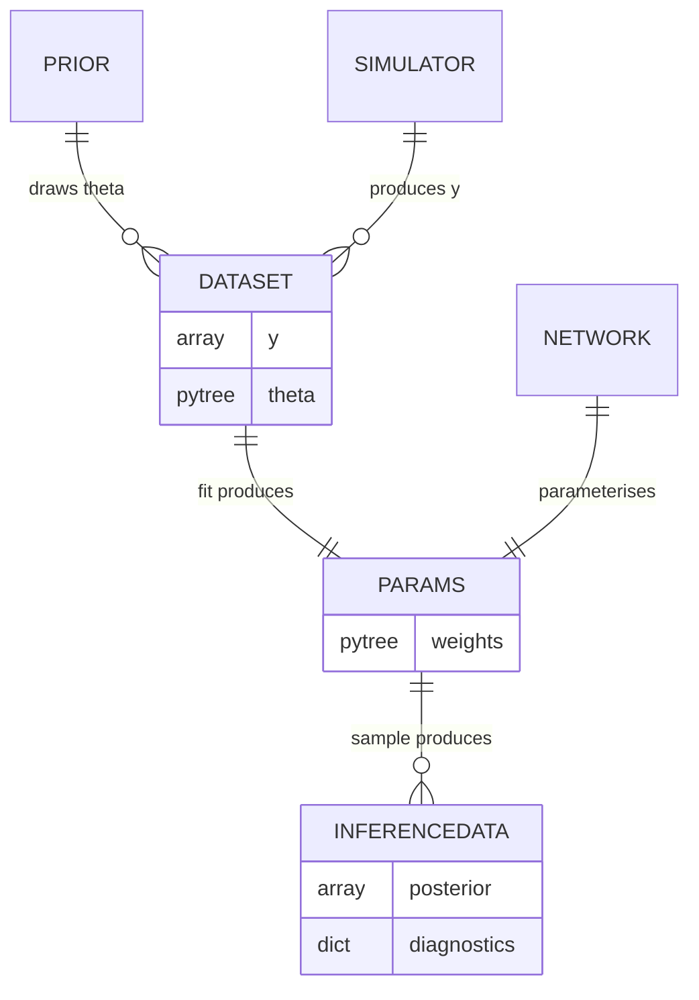
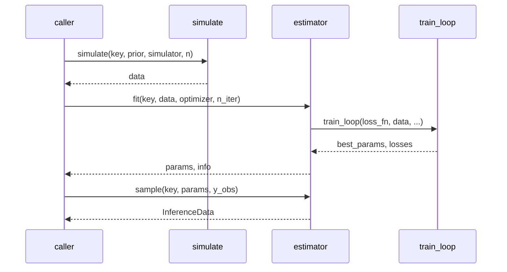
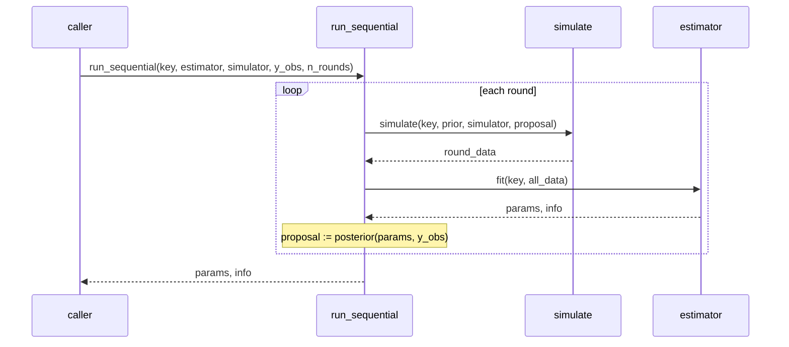

# sbijax 0.4 — Target Architecture

## Overview

sbijax is a JAX library for simulation-based inference (SBI). This document
defines the target architecture for a 0.4 redesign that moves the library from
stateful estimator classes to a **functional core** of composable pure functions
behind a **small set of uniform interfaces**, with a thin object-oriented facade
for continuity and a dedicated **conformance + calibration** test harness.

The design deliberately mirrors an idiom already proven in the sibling `tqe`
library — every method is a factory returning a record of pure functions — and
brings sbijax in line with the function-first conventions of optax, blackjax, and
distrax.

See [structural-assessment.md](structural-assessment.md) for the analysis that
motivated this work.

## Context

**Problem.** The current estimators are stateful god-objects: each class fuses
the loss, parameter init, training loop, data-simulation pipeline, posterior
sampling, and MCMC wiring, and shares behaviour through a four-level inheritance
chain with thin, leaky base classes. This makes methods hard to compose, hard to
test in isolation, and stylistically out of step with the JAX ecosystem.

**Constraints and decisions** (see [decisions.md](decisions.md)):

- Functional core with a thin OO facade (DR-001).
- Three honest interfaces rather than one forced abstraction (DR-002).
- A breaking 0.4 release is acceptable; a migration guide will accompany it
  (DR-003).
- The MCMC sampler is injected when a likelihood/ratio estimator is constructed
  (DR-004).
- Sequential inference is a standalone driver, not estimator state (DR-005).
- Data simulation is a standalone module; estimators consume data and no longer
  hold the simulator (DR-006).
- Estimators are stateless: `fit` returns explicit `(params, info)` (DR-007).

**Assumptions.**

- The prior is a constructed `tfd.Distribution` passed directly (already true on
  `main` after the simulator-seam change), not a zero-arg factory.
- Networks continue to come from the existing `nn/` factory functions.
- `InferenceData` (arviz) remains the posterior sample container.

## Components

The functional core is a set of small modules, each with a single
responsibility. Estimator factories compose them; they are not related by
inheritance.


### Core modules

| Module | Responsibility | Owns |
|--------|----------------|------|
| `simulate` | Draw `(theta, y)` from prior or a proposal and run the simulator; stack datasets. | Nothing (pure). |
| `objectives` | Per-method pure loss functions `(params, rng, **batch) -> scalar`. | Nothing. |
| `train_loop` | Generic epoch loop: optimizer step, weighted train/val loss, early stopping, best-param tracking. Already extracted. | Nothing. |
| `mcmc` (`run_blackjax`) | Turn a log-density into posterior draws via a BlackJAX kernel. Already extracted. | Nothing. |
| `estimator factories` | Compose prior + network + objective (+ sampler) into an `Estimator` record. | Closure over its dependencies; no mutable state. |
| `run_sequential` | Orchestrate multi-round inference: simulate from the current proposal, append, refit. | The round loop; no estimator state. |

### Interfaces

Three interfaces, because the families genuinely differ (DR-002):



- **Estimator** — trainable posterior/likelihood/ratio methods. `sample` has a
  uniform signature across the family; for NLE/NRE it runs the injected sampler
  internally, for amortized methods that argument is simply unused.
- **ABCSampler** — no neural training. Constructed with `(prior, simulator)`,
  exposes `sample` only; it simulates during sampling.
- **SummaryNet** — learns summary statistics rather than a posterior. `summarize`
  preprocesses data that is then fed to an Estimator.

### Facade

A thin OO layer preserves the familiar ergonomics. Each class holds its
constructor dependencies and, after `fit`, its trained params, delegating to the
core record. The facade contains no algorithm logic.

```
est = NLE(prior, net, sampler=nuts)   # wraps nle(...)
est.fit(key, data)                    # stores params internally
est.sample(key, y_obs)                # delegates to core sample(params, ...)
```

## Data Architecture

The central data entities and where they live:



**Ownership and flow.** No component owns mutable state. `simulate` produces a
`Dataset`; `Estimator.fit` consumes it and produces `params` plus an `info`
record (losses, diagnostics); `Estimator.sample` consumes `params` and an
observation and produces `InferenceData`. `params` is a plain pytree threaded
explicitly by the caller (or held by the facade) — this is the core of the
stateless design (DR-007).

### Amortized fit → sample



### Sequential (multi-round)



## API & Integration

Contracts are described, not implemented.

**Data pipeline**

- `simulate(rng_key, prior, simulator, *, proposal=None, n) -> Dataset` — draws
  `theta` from `proposal or prior`, runs `simulator`, returns `{y, theta}`.
- `stack(data, new_data) -> Dataset` — append datasets across rounds.

**Estimator** (constructed per method)

- `npe(prior, net, *, num_atoms=10) -> Estimator`
- `nle(prior, net, *, sampler=nuts) -> Estimator`
- `nre(prior, net, *, sampler=nuts, num_classes=...) -> Estimator`
- `Estimator.fit(rng_key, data, *, optimizer=None, n_iter, batch_size,
  n_early_stopping_patience, n_early_stopping_delta) -> (params, info)`
- `Estimator.sample(rng_key, params, observable, *, n_samples, **sampler_kwargs)
  -> InferenceData`

**ABCSampler**

- `sabc(prior, simulator, *, ...) -> ABCSampler`
- `ABCSampler.sample(rng_key, observable, *, summary, distance, ...) ->
  InferenceData`

**SummaryNet**

- `nass(prior, net) -> SummaryNet`
- `SummaryNet.fit(rng_key, data, *, ...) -> (params, info)`
- `SummaryNet.summarize(params, data) -> summaries`

**Sequential driver**

- `run_sequential(rng_key, estimator, simulator, observable, *, n_rounds,
  n_sims_per_round, ...) -> (params, info)`

**Communication pattern.** All calls are synchronous, pure JAX. The only
"injected dependencies" are the sampler (into likelihood/ratio estimators) and
the network/prior (into every factory) — each a swappable adapter chosen at
construction (DR-004).

## Cross-Cutting Concerns

**Correctness harness** (the credibility layer, DR-009). Three tiers:

1. *Conformance* — a registry-driven test that every Estimator/ABCSampler/
   SummaryNet satisfies its interface contract (return shapes, `InferenceData`
   structure) on a toy problem. Mirrors `tqe`'s `test_objective_contract.py`.
2. *Calibration* — simulation-based calibration (SBC) rank tests proving the
   posteriors are calibrated, run on a small analytically-tractable problem.
3. *Benchmark* — a small sbibm-style table proving recovery of known posteriors
   for a couple of reference tasks.

**Package geography** (DR-008). Group by inference family instead of the current
flat `_src/` dump:

```
_src/
  inference/
    posterior/   # npe, fmpe, cmpe
    likelihood/  # nle, snle
    ratio/       # nre
    summary/     # nass, nasss
  abc/           # sabc, smcabc
  simulate/      # data pipeline
  train/         # train_loop
  mcmc/          # run_blackjax + kernels
  nn/            # network factories
  facade/        # OO classes
  experimental/  # npse, aio, simformer
```

**Determinism / RNG.** Every entry point takes an explicit `rng_key`; no global
state. This is enforced by the stateless design and checked by the conformance
suite.

## Open Questions

- **`info` contents.** Minimum is training losses; SBC/diagnostics may ride
  along. Exact schema to be fixed when the conformance test is written.
- **Sequential proposal construction.** For NPE-style atomic methods the
  proposal is the current posterior; the precise handoff (`sample` vs a
  dedicated proposal object) is a Phase-2 detail for the tracer-bullet method.
- **Facade statefulness.** The facade holds `params` after `fit` for
  ergonomics; whether it also exposes the functional `(params, info)` return to
  advanced users needs a small API decision.
- **SNLE / NASS composition.** SNLE (surjective NLE) and the SummaryNet →
  Estimator pipeline need a documented composition pattern once the core lands.
```
